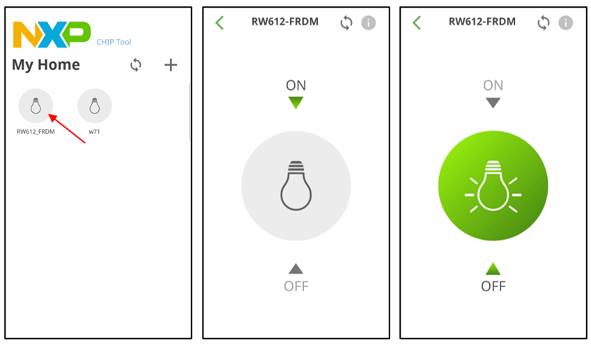

# NXP Application Code Hub
[](https://www.nxp.com)

## FRDM RW612 Matter light & switch app plus Thread Border Router solution

This example is built on Matter and the NXP RW612 SDK, supporting remote access and control of a light bulb over Wi-Fi with OpenThread Border Router (OTBR).<br />

The Matter FRDM-RW612 Light Switch Combo example demonstrates a dual-endpoint application. Endpoint 1 represents a Light Device (bulb), while Endpoint 2 functions as a Light Switch device.Buttons are used to either turn the local light bulb (Endpoint 1) on and off or control other bound lights via Endpoint 2, which acts as a switch. This example serves as a reference for developing your own Matter-based applications. <br />

It operates as a Matter accessory, meaning it can be paired with an existing Matter network and controlled through that network.<br />

#### Boards: FRDM-RW612
#### Categories: Wireless Connectivity, RTOS
#### Peripherals: Bluetooth, Wi-Fi, 802.15.4
#### Toolchains: GCC

## Table of Contents
1. [Software](#step1)
2. [Hardware](#step2)
3. [Setup](#step3)
4. [Flashing and debugging](#step4)
5. [Matter cli mode](#step5) 
6. [Demo with NXP chip-tool APP](#step6)
7. [Support](#step7)
8. [Release Notes](#8)

## 1. Software<a name="step1"></a>
In order to build the Project CHIP example, we recommend using a <strong>Linux
distribution</strong>.

The build system has been tested on the following Operating Systems:
- macOS 10.15
- Debian 11 (64 bit required)
- Ubuntu 22.04 LTS
- Windows 10 (experimental)

### Build system features

The Matter build system has the following features:

-   Very fast and small footprint
-   Cross-platform handling: Linux, Darwin, Embedded Arm, among others
-   Multiple toolchains & cross toolchain dependencies
-   Integrates automated testing framework: `ninja check`
-   Introspection: `gn desc`
-   Automatic formatting: `gn format`

## 2. Hardware<a name="step2"></a>
The following board is required:
- [FRDM-RW612](https://www.nxp.com/design/design-center/development-boards-and-designs/FRDM-RW612)

[](images/FRDM-RW61x.png)


## 3. Setup<a name="step3"></a>
- Make sure that below prerequisites are correctly installed .
```
sudo apt-get install git gcc g++ pkg-config libssl-dev libdbus-1-dev \
libglib2.0-dev libavahi-client-dev ninja-build python3-venv python3-dev \
python3-pip unzip libgirepository1.0-dev libcairo2-dev libreadline-dev
```
-   Step 1: Clone Matter repo:
```
$ git clone -b v1.4.0.0 https://github.com/NXP/matter.git && pushd . && cd matter && scripts/checkout_submodules.py --shallow --platform nxp --recursive &&source ./scripts/activate.sh && ./third_party/nxp/nxp_matter_support/scripts/update_nxp_sdk.py --platform common && popd
```
-   Step 2: Clone and overwrite the files
```
$ git clone https://github.com/nxp-appcodehub/ap-frdm-rw612-light-switch-otbr-combo.git && cp -r -f ap-frdm-rw612-light-switch-otbr-combo/examples matter/.
```

-   Step 3: Activate local environment 
```
$ cd matter
$ source ./scripts/activate.sh
```

-   Step 4: Build Matter with Border Router configuration with BLE commissioning (ble-wifi) 

```
$ cd examples/light-switch-combo-app/nxp/rt/rw61x
# Create the project
$ gn gen --args='chip_enable_wifi=true chip_enable_openthread=true nxp_enable_matter_cli=true board_version="frdm" nxp_use_factory_data=false chip_enable_ota_requestor=false no_mcuboot=true' out/debug
$ ninja -C out/debug
```

#### General information

The application binary can be found in
out/debug/<b>chip-rw61x-light-switch-combo-example</b>

Optional GN options that can be added when building an application:

-   To enable the
    [matter CLI](README.md#testing-the-all-clusters-application-with-matter-cli-enabled),
    the argument `chip_enable_matter_cli=true` must be added to the _gn gen_
    command.
-   By default, the `NXP RD-RW612-BGA` board revision will be chosen. To switch to `NXP FRDM-RW612` board revision, the argument
    `board_version=\"frdm\"` must be added to the _gn gen_ command.
-   To build the application in debug mode, the argument
    `is_debug=true optimize_debug=false` must be added to the _gn gen_ command.
-   To build with the option to have Matter certificates/keys pre-loaded in a
    specific flash area the argument `nxp_use_factory_data=true` can be added to
    the _gn gen_ command. (for more information see
    [Guide for writing manufacturing data on NXP devices](https://github.com/NXP/matter/blob/v1.4.0-pvw1/docs/guides/nxp/nxp_manufacturing_flow.md).
-   To build the application with the OTA Requestor enabled, the arguments
    `chip_enable_ota_requestor=true no_mcuboot=false` must be added to the _gn
    gen_ command. (More information about the OTA Requestor feature in
    [OTA Requestor README](https://github.com/NXP/matter/blob/v1.4.0-pvw1/docs/guides/nxp/nxp_rw61x_ota_software_update.md)


## 4. Flashinbg and debugging<a name="step4"></a>
There 2 ways to flash the application image to FRDK-RW612, Jlink, and MCUXpresso. The first way to flash the application on FRDM-RW612 is using the Jlink tool.

### 4.1 Flashing with JLink tool
1. Install [JLink_Windows](https://www.segger.com/downloads/jlink/)
2. The original application file name is `chip-rw61x-light-switch-combo-example.hex`. change the file extension form “.hex ” to “.srec ”, after the file name: <b>chip-rw61x-light-switch-combo-example.srec</b>

3. Create a txt file - `commands_script` and with the following content (change the application name accordingly):
```
reset
halt
loadfile chip-rw61x-light-switch-combo-example-frdm.srec
reset
go
quit
```
4. Copy the application and commands_script in the folder where the JLink executable is placed. Execute:
```
$  jlink -device RW612 -if SWD -speed 4000 -autoconnect 1 -CommanderScript commands_script
```
After the flash success, start the application on the RW612 FRDM.

### 4.2 Flashing with MCUXpresso IDE

In order to flash the application we recommended  using
[MCUXpresso IDE (version >= 11.6.0)](https://www.nxp.com/design/software/development-software/mcuxpresso-software-and-tools-/mcuxpresso-integrated-development-environment-ide:MCUXpresso-IDE).

-   Import the previously downloaded NXP SDK into MCUXpresso IDE. ([link](https://community.nxp.com/t5/MCUXpresso-IDE-Knowledge-Base/Importing-an-MCUXpresso-SDK-into-MCUXpresso-IDE/ta-p/1101175))

Right click the empty space in the MCUXpresso IDE "Installed SDKs" tab to show
the menu, select the "Import archive" (or "Import folder" if a folder is used)
menu item.

-   Import the connectedhomeip repo in MCUXpresso IDE as Makefile Project. Use
    _none_ as _Toolchain for Indexer Settings_:

```
File -> Import -> C/C++ -> Existing Code as Makefile Project
```

-   Configure MCU Settings:

```
Right click on the Project -> Properties -> C/C++ Build -> MCU Settings -> Select RW612 -> Apply & Close
```


-   Configure the toolchain editor:

```
Right click on the Project -> C/C++ Build-> Tool Chain Editor -> NXP MCU Tools -> Apply & Close
```


-   Create a debug configuration :

```
Right click on the Project -> Debug -> As->SEGGER JLink probes -> OK -> Select elf file
```

-   Debug using the newly created configuration file.

<a name="testing-the-example"></a>

## 5. Matter cli mode<a name="step5"></a>
CHIP Tool is a Matter controller which can be used to commission a Matter device
into the network. For more information regarding how to use the CHIP Tool
controller, please refer to the
[CHIP Tool guide](https://github.com/NXP/matter/blob/v1.4.0-pvw1/docs/guides/chip_tool_guide.md).

To know how to commission a device over BLE, follow the instructions from
[chip-tool's README.md 'Commission a device over
BLE'][readme_ble_commissioning_section].

[readme_ble_commissioning_section]:
https://github.com/NXP/matter/blob/v1.4.0-pvw1/examples/chip-tool/README.md#commission-a-device-over-ble

To know how to commissioning a device over IP, follow the instructions from
[chip-tool's README.md 'Pair a device over
IP'][readme_pair_ip_commissioning_section]

[readme_pair_ip_commissioning_section]:
https://github.com/NXP/matter/blob/v1.4.0-pvw1/examples/chip-tool/README.md#pair-a-device-over-ip

### Testing the chip-rw61x-light-switch-combo-example application with Matter CLI enabled:

The Matter CLI can be enabled with the chip-rw61x-light-switch-combo-example application.

For more information about the Matter CLI default commands, you can refer to the
dedicated [ReadMe](https://github.com/NXP/matter/blob/v1.4.0-pvw1/examples/shell/README.md).

The chip-rw61x-light-switch-combo-example application supports additional commands :

```
> help
[...]
mattercommissioning     Open/close the commissioning window. Usage : mattercommissioning [on|off]
matterfactoryreset      Perform a factory reset on the device
matterreset             Reset the device
```

-   `matterfactoryreset` command erases the file system completely (all Matter
    settings are erased). Or You can hold SW2 for 3 seconds for the device factoryreset.
-   `matterreset` enables the device to reboot without erasing the settings.

Here are described steps to use the light-switch-combo-app with the Matter CLI enabled

1. Prepare the board with the flashed `chip-rw61x-light-switch-combo-example` (as shown
   above).
2. The matter CLI is accessible in `MCU-Link`. For that, start a terminal emulator
   like PuTTY and connect to the used COM port with the following UART settings:

    - Baud rate: 115200
    - 8 data bits
    - 1 stop bit
    - No parity
    - No flow control

3. On the client side, start sending commands using the chip-tool application as
   it is described
   [here](https://github.com/NXP/matter/blob/v1.4.0-pvw1/examples/chip-tool/README.md#using-the-client-to-send-matter-commands).

## 6. Demo with NXP chip-tool APP<a name="step6"></a>
This chapter provides a demo tutorial on how to use the FRDM-RW612 with NXP’s Chip-Tool app for pairing and basic control operations. 

For more detailed information, please refer to the following link: <br>
[UG10178 Quick Start to the Matter Demo NXP CHIP Tool app, FRDM-RW612 and FRDMMCU W71 ](https://www.nxp.com/docs/en/user-guide/UG10178.pdf)


### 6.1 Install APK 
- Using the Android phone, go to the [Google Play Store](https://play.google.com/store)

- Search “NXP Matter Chip-tool”

[](images/install_apk.png)


### 6.2 Wi-Fi Prerequisites
Configure a externet AP as shown below.
- If the AP supports the IPv6 DHCP server, it must be `disabled`.
- WPA3 is not supported in the Matter demo binary for RW612. The AP must be configured in `WPA2 mode`.

Connect your android phone to the Access Point first .The Android phone and FRDM-RW612 must be connected to an Access Point and able to reach each other via its IPv6 address.


### 6.3 Commissioning FRDM-RW612
Please ensure that your phone is connected to the correct <b>AP</b> and that <b>Bluetooth</b> is turned on. And make sure your device has been <b>factory reset</b>. You can enter the Matter CLI mode to run `#matter factoryreset`, or press and hold SW2 for 3 seconds to reset the device to its factory settings. 

Step1 . Open the Chip-tool app and tap Pair New Device (WiFi Device).

[](images/pair_612_1.png)

Step2 . Select input manually , not scan QRcode.

Step3 . Enter the discriminator and PIN code (default values: 3840 and 20202021, respectively).

Step4 . Enter your Wi-Fi SSID and password. Once pairing is successful, assign a name to your device.<br>
`Note :  If there is still an error, wait a moment and repeat the step.`

Step5 . Once the device is successfully paired, you can control the switch.

[](images/rw612_control.png)

### 6.4  Setup OTBR on FRDM-RW612
When the FRDM-RW612 firmware startup, the OTBR will be automatically brought up.
<br>Get the OTBR table list as shown in the following example:
```
>otcli dataset active
Active Timestamp: 1
Channel: 17
Channel Mask: 0x07fff800
Ext PAN ID: 1111111122222222
Mesh Local Prefix: fdca:a943:242e:b986::/64
Network Key: 00112233445566778899aabbccddeeff
Network Name: OpenThread-b04c
PAN ID: 0x1234
PSKc: 8d4874b9ac7e0ad605179fc71af9a1c8
Security Policy: 672 onrc 0
Done
```
If you need to create a new thread netwrok , for Matter with OpenThread Border Router support, the matter CLI can be used to start/join the Thread network, using the following [ot-cli](https://openthread.io/reference/cli/commands) commands . 
```
> otcli dataset init new
Done
> otcli dataset
Active Timestamp: 1
Channel: 25
Channel Mask: 0x07fff800
Ext PAN ID: 42af793f623aab54
Mesh Local Prefix: fd6e:c358:7078:5a8d::/64
Network Key: f824658f79d8ca033fbb85ecc3ca91cc
Network Name: OpenThread-b870
PAN ID: 0xb870
PSKc: f438a194a5e968cc43cc4b3a6f560ca4
Security Policy: 672 onrc 0
Done
> otcli dataset panid 0xabcd
Done
> otcli dataset channel 25
Done
> otcli dataset commit active
Done
> otcli ifconfig up
Done
> otcli thread start
Done
> otcli state
leader
Done
```


## 7. Support<a name="step7"></a>
To enable Thread Border Router support see the [build](https://github.com/NXP/matter/blob/v1.4.0-pvw1/examples/all-clusters-app/nxp/rt/rw61x/README.md#building) section.

The complete Border Router guide is located [here](https://github.com/NXP/matter/blob/v1.4.0-pvw1/docs/guides/nxp/nxp_otbr_guide.md).

[UG10178](https://www.nxp.com/docs/en/user-guide/UG10178.pdf) Quick Start to the Matter Demo NXP CHIP Tool app, FRDM-RW612 and FRDMMCU W71 

Open Thread CLI Command Reference [link](https://openthread.io/reference/cli/commands)

#### Project Metadata

<!----- Boards ----->
[]()

<!----- Categories ----->
[](https://mcuxpresso.nxp.com/appcodehub?category=wireless_connectivity)
[](https://mcuxpresso.nxp.com/appcodehub?category=rtos)

<!----- Peripherals ----->
[](https://mcuxpresso.nxp.com/appcodehub?peripheral=bluetooth)
[](https://mcuxpresso.nxp.com/appcodehub?peripheral=wifi)
[](https://mcuxpresso.nxp.com/appcodehub?peripheral=802154)

<!----- Toolchains ----->
[](https://mcuxpresso.nxp.com/appcodehub?toolchain=gcc)

Questions regarding the content/correctness of this example can be entered as Issues within this GitHub repository.

>**Warning**: For more general technical questions regarding NXP Microcontrollers and the difference in expected functionality, enter your questions on the [NXP Community Forum](https://community.nxp.com/)

[](https://www.youtube.com/NXP_Semiconductors)
[](https://www.linkedin.com/company/nxp-semiconductors)
[](https://www.facebook.com/nxpsemi/)
[](https://x.com/NXP)

## 8. Release Notes<a name="step8"></a>
| Version | Description / Update                           | Date                        |
|:-------:|------------------------------------------------|----------------------------:|
| 1.0     | Initial release on Application Code Hub        | February 20<sup>th</sup> 2025 |

<small>
<b>Trademarks and Service Marks</b>: There are a number of proprietary logos, service marks, trademarks, slogans and product designations ("Marks") found on this Site. By making the Marks available on this Site, NXP is not granting you a license to use them in any fashion. Access to this Site does not confer upon you any license to the Marks under any of NXP or any third party's intellectual property rights. While NXP encourages others to link to our URL, no NXP trademark or service mark may be used as a hyperlink without NXP’s prior written permission. The following Marks are the property of NXP. This list is not comprehensive; the absence of a Mark from the list does not constitute a waiver of intellectual property rights established by NXP in a Mark.
</small>
<br>
<small>
NXP, the NXP logo, NXP SECURE CONNECTIONS FOR A SMARTER WORLD, Airfast, Altivec, ByLink, CodeWarrior, ColdFire, ColdFire+, CoolFlux, CoolFlux DSP, DESFire, EdgeLock, EdgeScale, EdgeVerse, elQ, Embrace, Freescale, GreenChip, HITAG, ICODE and I-CODE, Immersiv3D, I2C-bus logo , JCOP, Kinetis, Layerscape, MagniV, Mantis, MCCI, MIFARE, MIFARE Classic, MIFARE FleX, MIFARE4Mobile, MIFARE Plus, MIFARE Ultralight, MiGLO, MOBILEGT, NTAG, PEG, Plus X, POR, PowerQUICC, Processor Expert, QorIQ, QorIQ Qonverge, RoadLink wordmark and logo, SafeAssure, SafeAssure logo , SmartLX, SmartMX, StarCore, Symphony, Tower, TriMedia, Trimension, UCODE, VortiQa, Vybrid are trademarks of NXP B.V. All other product or service names are the property of their respective owners. © 2021 NXP B.V.
</small>
